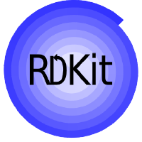
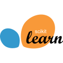

<!-- ===================== HERO ===================== -->

<!-- Typing animation -->

##  Hi, I'm Sharath

**Budding Computational Scientist** passionate about Bioinformatics, Computational Chemistry, and AI-driven scientific software.

I build reproducible, user-friendly tools that bridge life sciences and modern software engineering, with interests spanning computational biology, molecular modelling, scientific AI, and drug discovery.

&nbsp;&nbsp;&nbsp;

<!-- ===================== RESEARCH INTERESTS ===================== -->

## 🔬 Research Interests

<table>
<tr>
<td width="50%" valign="top">

**AI & Computational Chemistry**
- Molecular docking & virtual screening
- Molecular dynamics simulations & enhanced sampling methods
- MLOps for bioactivity prediction & Explainable AI
- Cheminformatics & molecular descriptors/fingerprints

</td>
<td width="50%" valign="top">

**Bioinformatics & HPC**
- Reproducible NGS/RNA-seq analysis pipelines
- Multiomics data analysis
- Differential expression & pathway/functional enrichment analysis
- Workflow automation & management

</td>
</tr>
</table>

<!-- ===================== TECHNOLOGIES ===================== -->

## 🧰 Tools & Technologies

<!-- Icons live in assets/logos/ — swap a file to change an icon.
     Table cells are used because GitHub renders README images as display:block. -->
<table>

<!-- Scientific Computing -->
<tr>
<td colspan="7" align="center"><b> Scientific Computing</b></td>
</tr>

<tr>
<td align="center"></td>

<td colspan="2"></td>
</tr>

<!-- Languages -->
<tr>
<td colspan="7" align="center"><b> Languages</b></td>
</tr>

<tr>
<td align="center"></td>
<td align="center"></td> 
<td align="center"></td>
<td align="center"></td>

<td colspan="3"></td>
</tr>

<td align="center"></td>
<td align="center"></td>

<td align="center"></td>
<td align="center"></td>
</tr>
<tr>
<td align="center"></td>

<td align="center"></td>
<td align="center"></td>
<td align="center"></td>
<td align="center"></td>
<td align="center"></td>
</tr>
</table>

